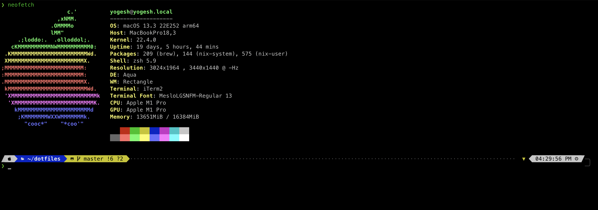

# Yogesh Kotadiya's dotfiles

Personal Runtime Configuration and Settings for various programs that I use.

---

### Terminal / Zsh Config

## 

- Oh-my-zsh
- Powerlevel10k
- Tmux
- Nerdfonts
- Full git support
- Zsh plugins (autosuggestions, syntax highlighting, completion)
- Custom aliases and many more.

Check out the `.zshrc` file or download directly with `wget`

```bash
$ wget -P ~/ https://raw.githubusercontent.com/yogeshkotadiya/dotfiles/master/.zshrc
```

### Vim / NeoVim


- Vim Plug
- Vim Airplay Theme
- Git Support
- Syntax Highlighting
- Auto Completion
- Language Support
  - Javascript
  - React / JSX
  - Golang
  - Rust
- Autoformating using Prettier
- Linting Engine (ALE)

### Resources

- [Oh-my-zsh](https://ohmyz.sh/)
- [Powerlevel10K](https://github.com/romkatv/powerlevel10k)
- [NeoVim](https://github.com/neovim/neovim)

Give it a :star: if you like it
Thank You

MIT [Yogesh Kotadiya](https://github.com/yogeshkotadiya)
